# Figures 
Explaination of figures

## 211209_H1975_pca_jointplot.png
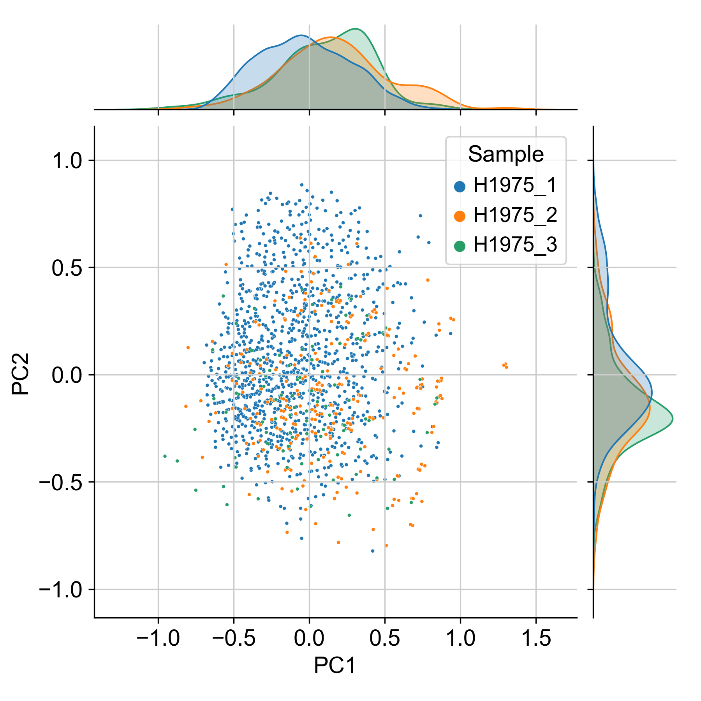
H1975 scatter plot of the first two principal components with relative sample density along each axis.  

## 211209_H1975_pca_comps_violin.png
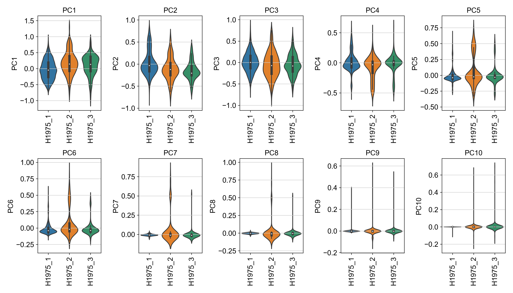
Violin plot showing the distibution of the first 10 principal components for each H1975 batch. 

## 211210.Patients.heatmap_targets.png
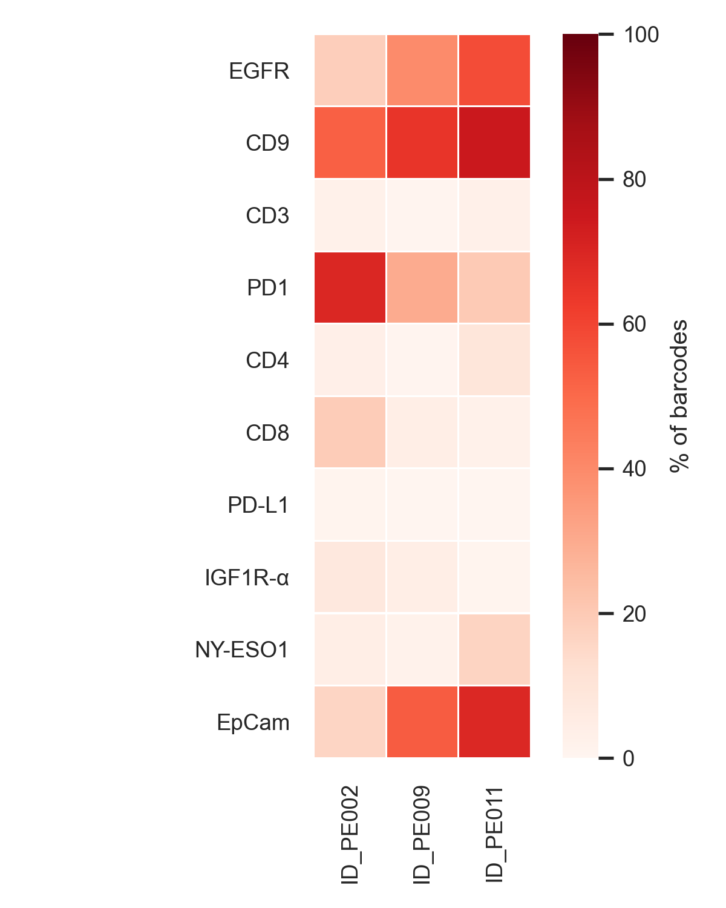
Occurence of target as a rate of the total number of barcodes. 

## 211209.Patients.heatmap_top30_combos.png
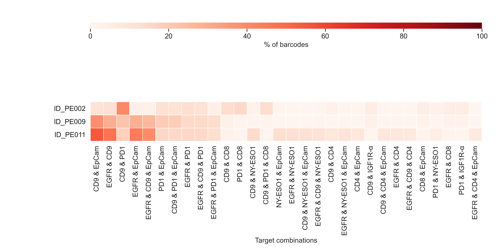
Occurence of Target combinations (2-4 combined) as a rate of the total number of barcodes. Top30 by total occurated over all samples. 

## 211210.Patients.violinplots.png
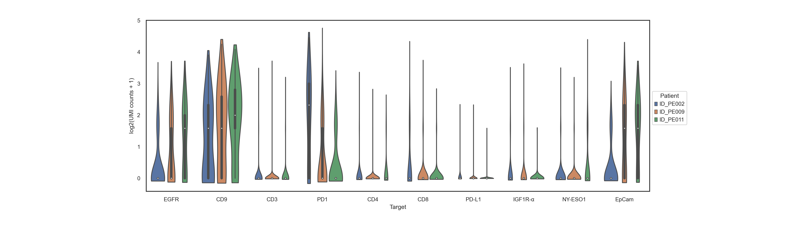
Violinplot showing the distrobution of log2 transfromed UMI counts for each target and sample. Boxplot shown inside each violin. 

## 211210.Patients.violinplots_select.png
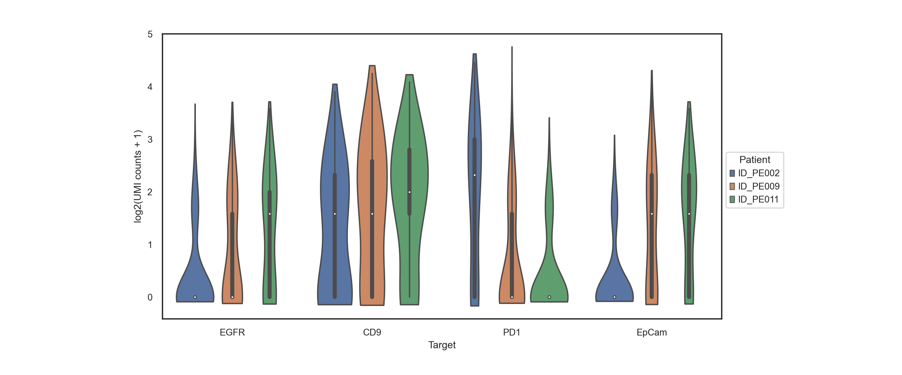
Violinplot showing the distrobution of log2 transfromed UMI counts for EGFR, CD9, PD1 and EpCam and each sample. Boxplot shown inside each violin. 

## umap211209_Patients_UMAP_louvain.png
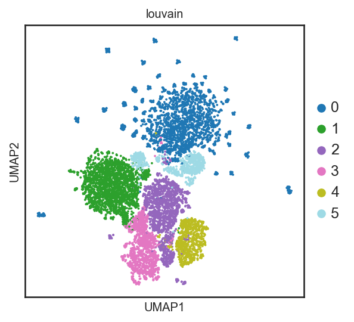
UMAP embedding of all patient samples droplets (with >2 targets) showing the called louvain clusters. 

## umap211209_Patients_UMAP_targets.png
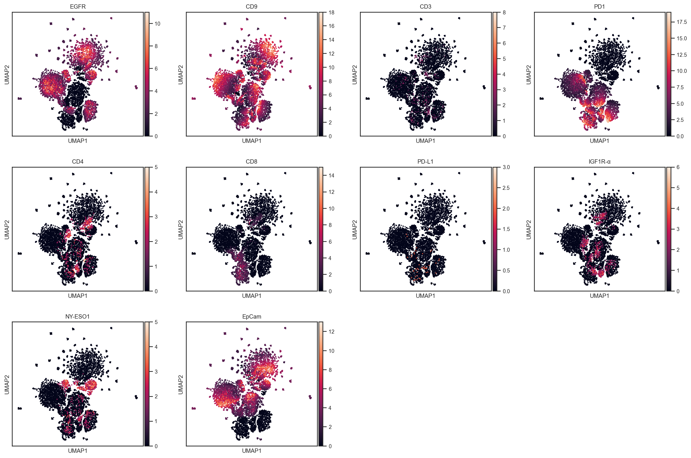
UMAP embedding of all patient samples droplets (with >2 targets) showing the expression of each target. 

## umap_density_Sample_211209_Patients_UMAP_density.png
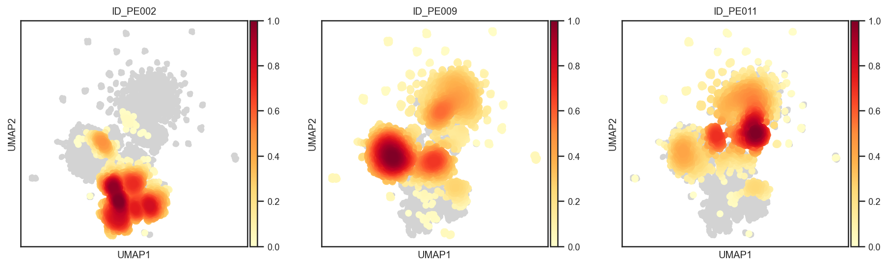
UMAP embedding of all patient samples droplets (with >2 targets) showing the density of each sample. 

## 211210_Patients_louvain_proportions.png
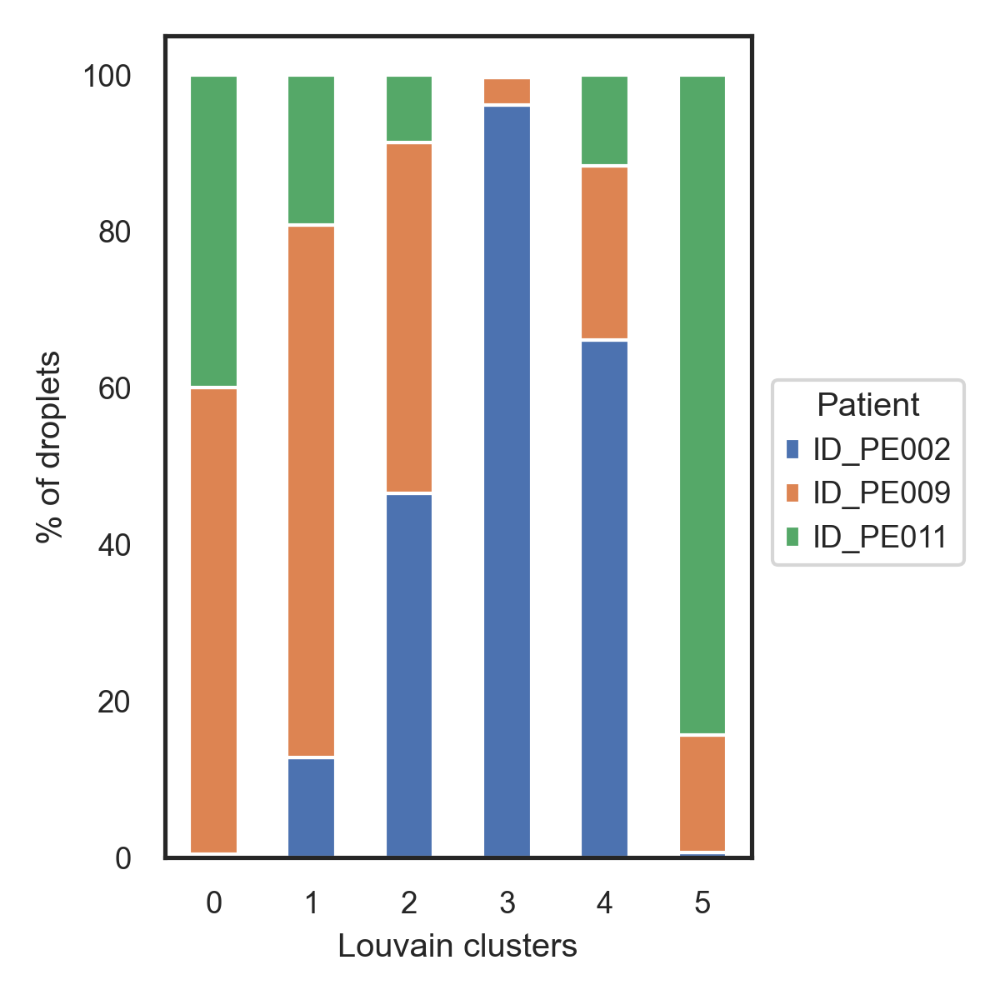
Stacked bar chart showing the relative proportion of each sample in each louvain cluster. 

## 211210_Patients_louvain_target_dotplot.png
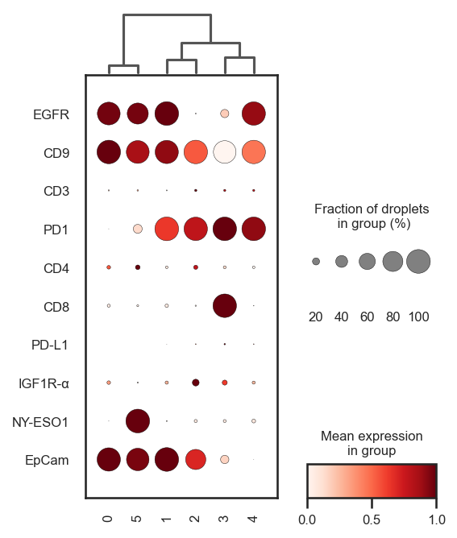
Dotplot showing the fraction of droplets expressing and relative expression of each target across louvain clusters. Dendrogram on top shows the relationship between clusters.

## heatmap211209_Patients_louvain_target_heatmap.png
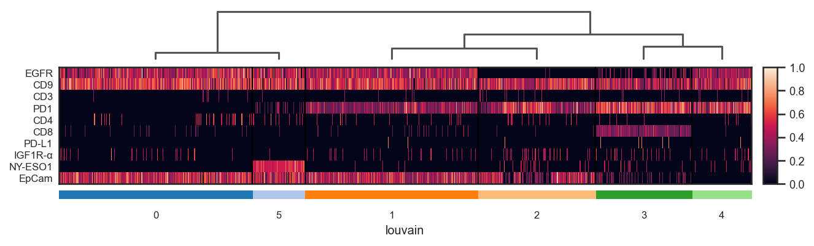
Heatmap showing the relative expression of each target across louvain clusters. Each column represent one droplets. Dendrogram on top shows the relationship between clusters.

## 220216.H1975.heatmap_top20_combos.png

Heatmap for the top 20 combinations for droplets expressing 2 or more targets for H1975 samples
